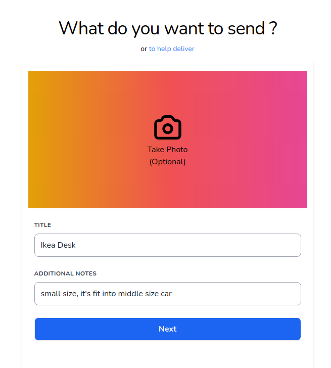
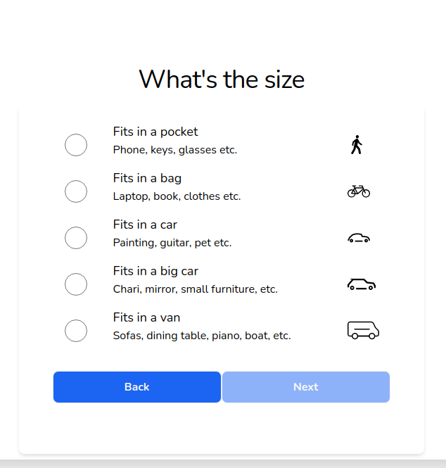
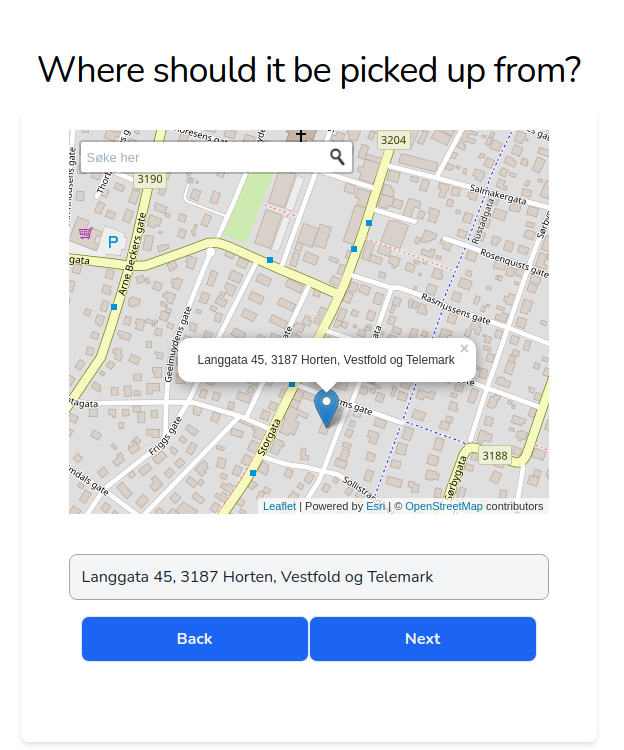

# Delivery Friend Application

### Key tech stacks
 - PHP: 8.0v
 - Laravel: 8.12v
 - Alpine.Js: 2.8v
 - Livewire: 2.0v
 - Tailwind: 1.8v
 - Vue: 3.0
 - Leaflet: 1.7.1v
 - Esri Leaflet: 2.5.3v

### Logic sequences

#### 1. Regist new delivery order as "Sending menu"
 - Take delivery item's picture with a title and description.
 - Item size select
 - Automatically take current user's geolocation position or get manually
 - Regist date and time
 - Destinition address select

#### 2. Search registred tasks from DB
 - Sort by location and order type
 - List up Descending and Ascending
 - By expect revenue or favorites
